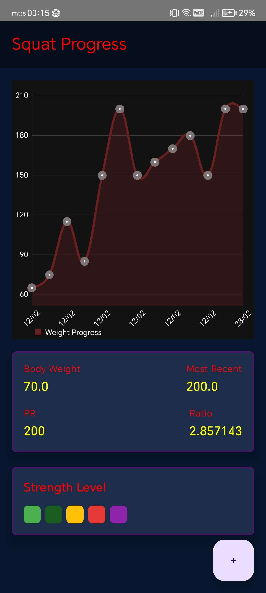
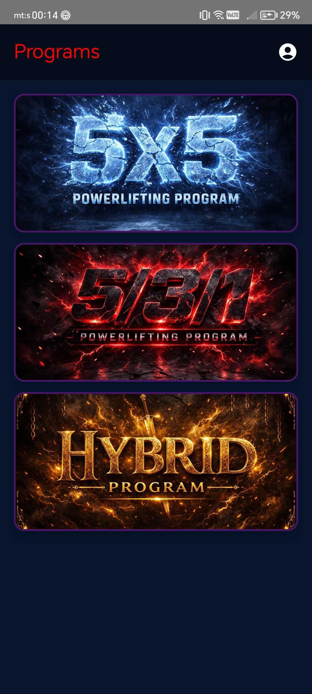
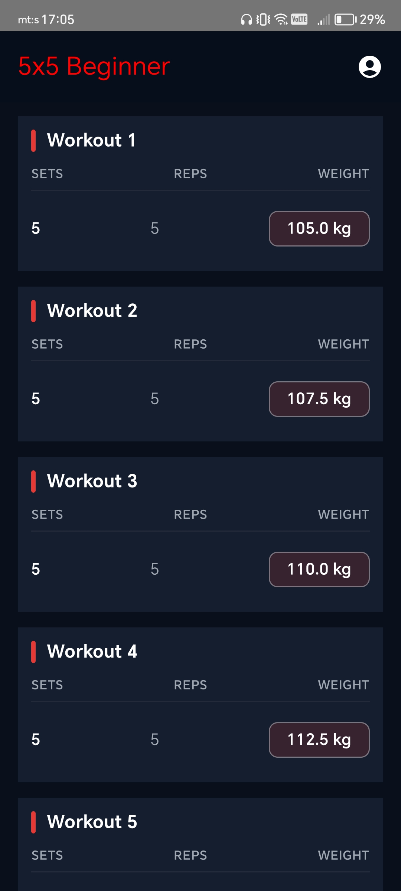
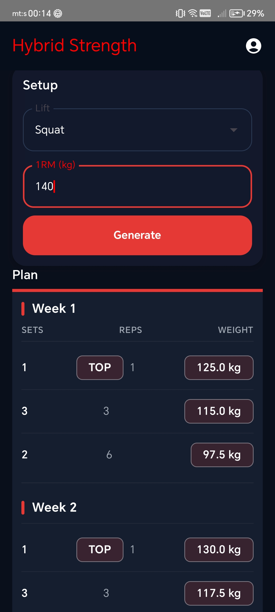

# 🏋️ GymApp – Strength Training Tracker

GymApp is a modern Android application designed for strength athletes who want to track progress, visualize performance, and calculate structured training programs automatically.

Built with Kotlin and Jetpack Compose, the app focuses on clean architecture, reactive state management, and a serious strength-training oriented UI.

---

## 🚀 Features

### 📈 Progress Tracking

Track your lifts for:
- Squat
- Bench Press
- Deadlift

Features:
- Add lift entries with weight and date
- Automatic PR (Personal Record) updates
- Strength ratio calculation
- Interactive progress chart
- Visual strength level indicator
- Historical tracking

---

### 📋 Training Programs

Choose from structured strength programs:

- **5x5 Beginner**
- **5/3/1**
- **Hybrid Strength**

Each program includes:
- Expandable program description
- Lift selector (Squat / Bench / Deadlift)
- 1RM input field
- Automatic 4-week calculation
- Structured table view (Sets / Reps / Weight)

---

## 🧮 Program Algorithms

### 🔹 5x5 Beginner
- Starts at ~70% of 1RM
- Linear progression
- Auto-increment (2.5kg or 5kg depending on weight)
- Displayed as workouts instead of weeks

---

### 🔹 5/3/1
- Based on percentage waves
- Weekly intensity progression
- Structured strength-focused approach

---

### 🔹 Hybrid Strength
- Top set progression:
    - Week 1 – 88%
    - Week 2 – 91%
    - Week 3 – 93%
    - Week 4 – 95%
- Volume progression:
    - 3x3 increases weekly (80–86%)
    - 2x6 constant at 70%
- All values rounded to nearest 2.5kg

---

## 🎨 UI Philosophy

- Dark performance aesthetic
- Red accent highlights
- Compact table layout (Sets / Reps / Weight)
- Minimal distractions
- Strength-focused visual hierarchy

Designed to feel like a serious lifting tool, not a generic fitness app.

---

## 🛠 Tech Stack

- Kotlin
- Jetpack Compose
- Material 3
- MVVM Architecture
- Room (Local Database)
- Hilt (Dependency Injection)
- StateFlow
- MPAndroidChart

---

## 📸 Screenshots

---

## 🎯 Future Improvements

- Workout execution mode
- Rest timer
- Plate calculator
- Advanced analytics
- Cloud sync
- Export data

---

## 📌 Author

Djordje Teofilovic  
Computer Science Student  
Strength Training Enthusiast

---

## 📄 License

This project is for educational and portfolio purposes.
